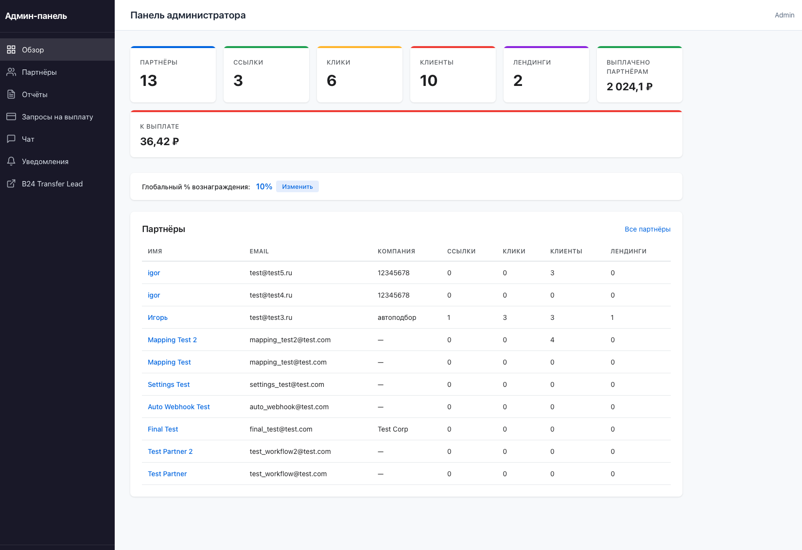
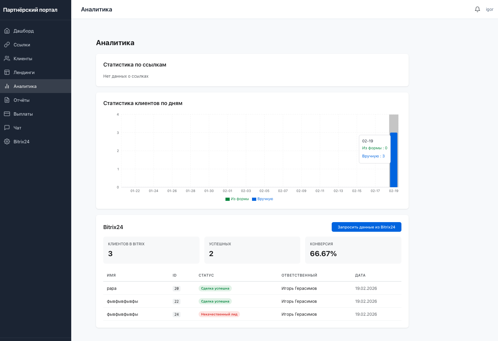
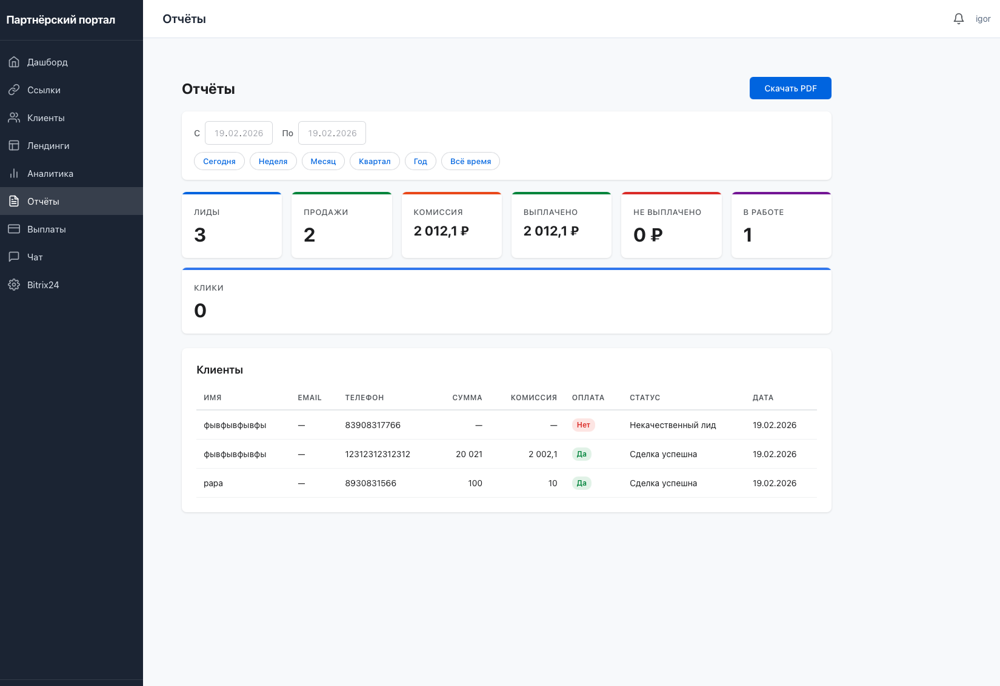

# Партнёрский кабинет Bitrix24

Веб-приложение для управления партнёрской программой с полной интеграцией в Bitrix24. Партнёры получают инструменты для привлечения клиентов — ссылки, лендинги, QR-коды, UTM-метки — а администратор контролирует весь процесс через единую панель управления.

---

## Стек технологий

| Слой            | Технологии                                                        |
|-----------------|-------------------------------------------------------------------|
| **Backend**     | Python 3.11, FastAPI, SQLAlchemy 2.0 (async), Alembic, Pydantic v2 |
| **Frontend**    | React 18, TypeScript, Vite 5, React Router 6, Recharts            |
| **БД**          | SQLite (aiosqlite)                                                 |
| **B24 Service** | Python 3.12, FastAPI, SQLAlchemy, httpx                            |
| **Инфра**       | Docker, docker-compose                                             |

---

## Быстрый старт

```bash
# Клонировать репозиторий
git clone https://github.com/darkClaw921/partner_bitrix24_cabinet && cd partner_bitrix24_cabinet

# Запустить все сервисы
docker compose -f docker-compose.dev.yml up --build
```

После запуска:

| Сервис               | URL                        |
|----------------------|----------------------------|
| Frontend             | http://localhost:5173       |
| Backend API          | http://localhost:8000       |
| B24 Transfer Lead UI | http://localhost:5173/b24/  |

Админ-аккаунт создаётся автоматически при старте из переменных окружения `ADMIN_EMAIL` / `ADMIN_PASSWORD`.

---

## Архитектура

```
┌──────────────┐     ┌──────────────┐     ┌──────────────────┐     ┌───────────┐
│   Frontend   │────▶│   Backend    │────▶│ b24-transfer-lead│────▶│ Bitrix24  │
│  React/Vite  │     │   FastAPI    │     │     FastAPI      │     │   CRM     │
│  :5173       │     │   :8000      │     │   :7860          │     │           │
└──────────────┘     └──────┬───────┘     └──────────────────┘     └───────────┘
                            │
                       ┌────▼────┐
                       │ SQLite  │
                       │ app.db  │
                       └─────────┘
```

- **Frontend** проксирует `/api` запросы на Backend
- **Backend** общается с b24-transfer-lead через HTTP (заголовок `X-Internal-API-Key`)
- **b24-transfer-lead** создаёт лиды/сделки в Bitrix24 и обрабатывает вебхуки

---

## Функции сервиса

### Партнёрский кабинет

#### Партнёрские ссылки
Создание и управление реферальными ссылками трёх типов: прямая, iframe, лендинг. Каждая ссылка имеет уникальный код, поддерживает UTM-метки (source, medium, campaign, content, term) и автоматический редирект с подстановкой UTM-параметров в целевой URL.

#### QR-коды
Генерация QR-кодов для любой партнёрской ссылки прямо в браузере (qrcode.react). Доступна загрузка в форматах PNG и SVG.

#### Лендинги
Визуальный редактор лендингов с загрузкой изображений, слайдером и встроенной CRM-формой. Лендинг привязывается к партнёрской ссылке и доступен по публичному URL.

#### Клиенты
Список привлечённых клиентов с источником (форма лендинга / ручной ввод), статусом сделки из Bitrix24, суммой сделки и рассчитанной комиссией партнёра. Поддержка пагинации.

#### Аналитика и дашборд
Сводная статистика: клики, клиенты, конверсия. Графики кликов по дням (Recharts). Детальная аналитика по каждой ссылке и данные конверсии из Bitrix24.

#### Отчёты
Формирование отчётов за произвольный период с ключевыми метриками: лиды, продажи, комиссия, выплаты. Выбор периода через пресеты (сегодня, неделя, месяц, квартал, год) или вручную. Скачивание в PDF.

#### Запросы на выплату
Партнёр выбирает клиентов с рассчитанным вознаграждением и создаёт запрос на выплату. Сумма рассчитывается автоматически. Отслеживание статуса: ожидает, одобрен, отклонён.

#### Чат с поддержкой
Персональный чат с администратором. Пузыри сообщений, авто-скролл, badge с непрочитанными, обновление каждые 30 секунд.

#### Уведомления
In-app уведомления от администратора: колокольчик с badge, выпадающий список, автоматическая проверка каждые 30 секунд.

#### Настройки Bitrix24
Подключение к Bitrix24: выбор воронки, этапов, статусов лидов. Просмотр созданных лидов и статистики конверсии.

---

### Админ-панель

#### Обзорная статистика
Агрегированные данные по всем партнёрам: общее количество кликов, клиентов, конверсия, суммы сделок и комиссий. Таблица партнёров с ключевыми показателями.

#### Управление партнёрами
Полная таблица всех партнёров с детализацией. Просмотр ссылок, клиентов, платежей каждого партнёра. Установка индивидуального процента вознаграждения.

#### Управление выплатами
Обработка запросов партнёров на выплату: одобрение или отклонение с комментарием. Badge с количеством ожидающих запросов. Управление оплатой отдельных клиентов и массовое обновление.

#### Сводные отчёты
Отчёт по всем партнёрам или по конкретному за выбранный период. Метрики по каждому партнёру в таблице. Экспорт в PDF.

#### Чат с партнёрами
Двухпанельный интерфейс: список переписок слева, сообщения справа. Badge с общим количеством непрочитанных.

#### Уведомления
Создание broadcast-уведомлений для всех партнёров или адресных — для конкретного. Управление списком уведомлений.

#### B24 Transfer Lead
Встроенный доступ к интерфейсу b24-transfer-lead через iframe в админ-панели.

#### Глобальные настройки
Управление глобальным процентом вознаграждения, конфигурацией подключения к Bitrix24.

---

## Скриншоты

### Админ-панель
| Аналитика | Отчёты |
|-----------|--------|
|  |  |

### Партнёрский кабинет
| Аналитика | Отчёты |
|-----------|--------|
|  |  |

---

## Система ролей

| Роль        | Доступ                                    | Создание                              |
|-------------|-------------------------------------------|---------------------------------------|
| **partner** | Партнёрский кабинет                       | Регистрация через `/register`         |
| **admin**   | Админ-панель + партнёрский кабинет        | Автоматически из env при старте       |

---

## Переменные окружения

<details>
<summary>Backend</summary>

| Переменная                  | По умолчанию                           | Описание                              |
|-----------------------------|----------------------------------------|---------------------------------------|
| `BACKEND_DATABASE_URL`      | `sqlite+aiosqlite:///./data/app.db`    | URL базы данных                       |
| `BACKEND_SECRET_KEY`        | `dev-secret-key-change-in-production`  | Секретный ключ JWT                    |
| `BACKEND_CORS_ORIGINS`      | `["http://localhost:5173"]`            | Разрешённые CORS origins              |
| `BACKEND_B24_SERVICE_URL`   | `http://b24-service:7860`              | URL сервиса b24-transfer-lead         |
| `B24_INTERNAL_API_KEY`      | `dev-internal-api-key`                 | API ключ для b24-transfer-lead        |
| `B24_WEBHOOK_URL`           | —                                      | Webhook URL Bitrix24                  |
| `B24_ENTITY_TYPE`           | `lead`                                 | Тип сущности (lead/deal)              |
| `DEFAULT_REWARD_PERCENTAGE` | `10.0`                                 | Глобальный % вознаграждения           |
| `BACKEND_ADMIN_EMAIL`       | `admin@partner-cabinet.com`            | Email администратора                  |
| `BACKEND_ADMIN_PASSWORD`    | `admin123456`                          | Пароль администратора                 |

</details>

<details>
<summary>B24 Transfer Lead</summary>

| Переменная             | По умолчанию               | Описание                         |
|------------------------|----------------------------|----------------------------------|
| `B24_MAIN_DB_URL`      | `sqlite:///./data/main.db` | URL базы данных                  |
| `B24_SECRET_KEY`       | `dev-b24-secret`           | Секретный ключ                   |
| `B24_INTERNAL_API_KEY` | `dev-internal-api-key`     | API ключ для межсервисного доступа|
| `B24_ADMIN_USERNAME`   | `cabinet_admin`            | Имя пользователя админа          |
| `B24_ADMIN_PASSWORD`   | `cabinet_admin_pass`       | Пароль админа                    |

</details>

---

## Интеграция с Bitrix24

```
Партнёр создаёт клиента → Backend отправляет в b24-transfer-lead → Лид/сделка в Bitrix24
                                                                            │
Bitrix24 webhook → Backend обновляет статус сделки ← ─ ─ ─ ─ ─ ─ ─ ─ ─ ─ ─┘
                   + рассчитывает deal_amount и partner_reward
                   + отправляет уведомление партнёру
```

При регистрации партнёра автоматически создаётся workflow в b24-transfer-lead с настройками из переменных окружения. Все партнёры используют единый webhook URL Bitrix24.

---

## Структура проекта

```
partner_bitrix24_cabinet/
├── docker-compose.dev.yml      # Конфигурация Docker (4 сервиса)
├── backend/                    # FastAPI backend (Python 3.11)
│   ├── app/
│   │   ├── models/             # SQLAlchemy модели (Partner, Link, Client, ...)
│   │   ├── schemas/            # Pydantic схемы
│   │   ├── routers/            # API эндпоинты
│   │   ├── services/           # Бизнес-логика
│   │   └── utils/              # Миграции, безопасность
│   ├── alembic/                # Миграции БД
│   └── landing_template/       # Jinja2 шаблон лендинга
├── frontend/                   # React SPA (TypeScript, Vite)
│   └── src/
│       ├── api/                # API-клиенты (Axios)
│       ├── components/         # UI-компоненты
│       ├── pages/              # Страницы (партнёр + admin/)
│       ├── context/            # Auth, Toast контексты
│       └── hooks/              # Custom hooks
├── b24-transfer-lead/          # Сервис интеграции с Bitrix24
│   └── src/backend/            # FastAPI app
└── data/                       # SQLite БД (Docker volume)
```
