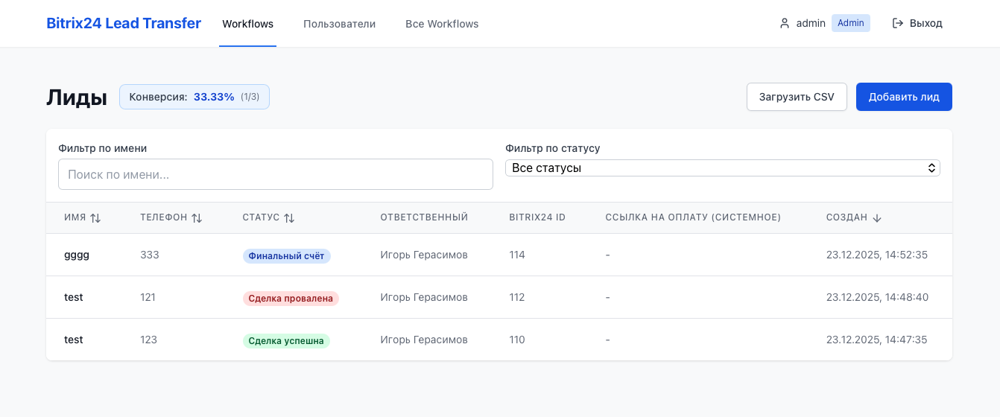
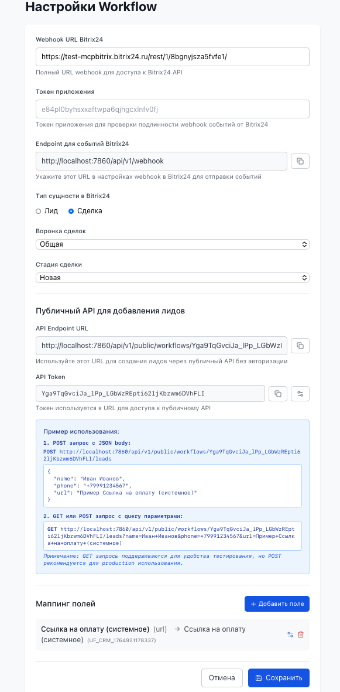

<div align="center">

# Bitrix24 Lead Transfer

### Веб-приложение для автоматизации трансфера лидов в Bitrix24

<p align="center">
  
</p>

<p align="center">
  <a href="#возможности">🚀 Возможности</a> · 
  <a href="#установка-и-запуск">📦 Установка</a> · 
  <a href="architecture.md">📚 Документация</a> · 
  <a href="#api-endpoints">🔌 API</a>
</p>

</div>

<br />

## Возможности

- Создание и управление workflow (каждый workflow = отдельная БД)
- Добавление лидов вручную, через API или загрузку CSV файлов
- Автоматическое создание лидов в Bitrix24 при добавлении
- Обработка webhook от Bitrix24 для обновления статусов лидов
- Админ-панель для управления пользователями и workflow
- Интерфейс таблиц с фильтрацией и сортировкой

## Пример workflow
<p align="center">
  
</p>

## Пример настроек workflow
<p align="center">
  
</p>

## Технологии

### Backend
- FastAPI
- SQLAlchemy
- SQLite (для workflow БД)
- Pydantic
- bcrypt
- httpx

### Frontend
- React 19
- TypeScript
- Vite
- Tailwind CSS
- Zustand
- React Router
- Axios

## Установка и запуск

### Запуск через Docker Compose (рекомендуется)

1. Создайте файл `.env` (опционально) для настройки переменных окружения:
```bash
cp .env.example .env
```


2. Запустите приложение:
```bash
docker-compose up -d --build
```

3. Приложение будет доступно:
   - Frontend: http://localhost:3012

4. **Важно**: Базы данных хранятся на хосте в текущей директории проекта:
   - `main.db` - основная база данных (пользователи, workflow)
   - `workflows/` - директория с базами данных для каждого workflow
   - Данные сохраняются при перезапуске или удалении контейнеров

5. Остановка приложения:
```bash
docker-compose down
```

**Примечание**: При первом запуске файлы баз данных будут созданы автоматически. При пересборке контейнеров данные сохраняются благодаря volumes.

### Локальная установка

#### Требования
- Python 3.12+
- Node.js 20+ (LTS)
- uv (менеджер пакетов Python)

### Backend

1. Установите зависимости:
```bash
uv sync
```

2. Создайте файл `.env` (опционально):
```bash
cp .env.example .env
```


Backend будет доступен по адресу: http://localhost:7860

### Frontend

```bash
cd src/frontend && npm install && npm run dev
```
### Backend
```bash
uv run uvicorn src.backend.main:app --reload --port 7860
```

Frontend будет доступен по адресу: http://localhost:3000

**Примечание**: При локальной разработке публичный API endpoint будет доступен через фронтенд на порту 3000 (в dev-режиме) или 3012 (в production через Docker).

## Первоначальная настройка

1. Создайте первого администратора через Python:
```bash
uv run create_admin.py
```

2. Войдите в систему с созданными учетными данными

3. Создайте workflow с настройками Bitrix24:
   - URL портала Bitrix24
   - Webhook token для REST API

4. Настройте webhook в Bitrix24:
   - URL: `http://your-server/api/v1/webhook/{workflow_id}`
   - События: `ONCRMLEADUPDATE`, `ONCRMLEADADD`, `ONCRMDEALUPDATE`, `ONCRMDEALADD`

## Использование

### Создание лида

1. Выберите workflow
2. Нажмите "Добавить лид" или "Загрузить CSV"
3. Лид автоматически создастся в Bitrix24

### Формат CSV файла

CSV файл должен содержать колонки:
- `phone` (или `телефон`)
- `name` (или `имя`)

Пример:
```csv
phone,name
+79991234567,Иван Иванов
+79997654321,Петр Петров
```

### API Endpoints

#### Авторизация
- `POST /api/v1/auth/login` - Вход
- `POST /api/v1/auth/logout` - Выход
- `GET /api/v1/auth/me` - Текущий пользователь

#### Workflows
- `GET /api/v1/workflows` - Список workflow
- `POST /api/v1/workflows` - Создать workflow
- `GET /api/v1/workflows/{id}` - Получить workflow
- `DELETE /api/v1/workflows/{id}` - Удалить workflow

#### Leads
- `GET /api/v1/workflows/{id}/leads` - Список лидов
- `POST /api/v1/workflows/{id}/leads` - Создать лид
- `POST /api/v1/workflows/{id}/leads/upload` - Загрузить CSV

#### Webhook
- `POST /api/v1/webhook` - Webhook от Bitrix24 (единый endpoint для всех workflow)

#### Публичный API
- `POST /api/public/workflows/{token}/leads` - Создать лид через публичный API (без авторизации)
- `GET /api/public/workflows/{token}/leads` - Создать лид через публичный API с query параметрами (для удобства тестирования)

**Примечание**: Публичный API доступен через фронтенд на порту 3012 (в production) или 3000 (в dev-режиме). URL генерируется автоматически при создании API токена в настройках workflow.

## Структура проекта

Подробное описание архитектуры см. в [architecture.md](architecture.md)


## Лицензия

MIT

